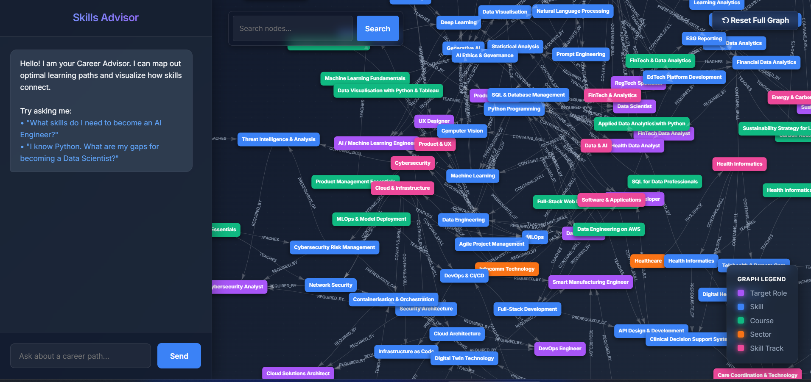

# Skill & Competency Graph System Architecture & Design Document

An AI-powered, graph-based learning platform that maps the SkillsFuture dataset into Neo4j to compute optimal learning paths and intelligent gap analyses. It features a natural language LLM interface paired with an interactive, real-time graph visualization.

---

## 1. Architecture & Key Features

The system operates on a highly decoupled **4-Part Pipeline**, built for speed, accuracy, and interactive visualization:

*   **Data Layer (Neo4j Graph Database)**: Data is natively modeled as a highly connected graph separating Sectors, SkillTracks, Skills, JobRoles, and Courses.
*   **Query Engine (Python + Cypher)**: The `QueryService` executes exact deterministic mathematics. It runs Topological Sorting algorithms to compute optimal learning paths and intelligent gap analyses (ranking missing skills based on calculated "unlock scores" and distance).
*   **LLM Router (Groq LLaMA-3)**: Acts as an intelligent translation layer. It translates natural language input (e.g., "What do I need to become an AI Engineer?") into structured intents, routes the request to the Query Engine, and translates mathematical results back into conversational English.
*   **Visualization (Vanilla JS + vis-network)**: A completely decoupled `index.html` frontend that renders the graph outputs in real-time alongside the AI Chatbot.

---

## 2. Project Structure

The codebase is modularly separated to cleanly divide the Database Engine, the API layer, the LLM, and the Frontend.

```text
HeyHiAssessment/
├── api/                  # REST API Layer
│   ├── main.py           # FastAPI endpoints (/api/chat, /api/graph)
│   └── models.py         # Pydantic schemas for request/response validation
├── data/                 # Raw dataset
│   └── skillsfuture_dataset.json
├── docs/                 # Documentation
├── frontend/             # User Interface
│   └── index.html        # Single-page Vanilla JS app with vis-network
├── src/                  # Core Domain Logic
│   ├── graph_builder.py  # Neo4j schema creation and data ingestion engine
│   ├── llm_service.py    # Natural Language translation layer (Groq LLaMA-3)
│   └── query_service.py  # Graph mathematical engine (Cypher + Python logic)
├── tests/                # Testing Suite
│   ├── integration/      # End-to-End API and LLM system tests
│   └── unit/             # Pytest suite for internal graph logic
├── docker-compose.yml    # Docker configuration for Neo4j database
├── requirements.txt      # Python dependencies
└── README.md             # This document
```

---

## 3. Setup Instructions

1. **Install Dependencies**
   ```bash
   pip install -r requirements.txt
   ```

2. **Configure Environment Variables**
   Create a `.env` file in the root directory:
   ```env
   NEO4J_URI=bolt://localhost:7687
   NEO4J_USER=neo4j
   NEO4J_PASSWORD=password
   GROQ_API_KEY=your_groq_api_key_here
   ```

3. **Start the Database**
   ```bash
   docker-compose up -d
   ```

4. **Ingest Data into Neo4j**
   ```bash
   python src/graph_builder.py
   ```
   *Note: This will clear existing data, setup constraints, and ingest the `skillsfuture_dataset.json`.*

5. **Start the API & Web App**
   ```bash
   uvicorn api.main:app --reload
   ```
   Navigate to [http://localhost:8000](http://localhost:8000) to see the interactive Visualization & Chat app!



---

## 4. API Documentation & Examples

Interactions with the API endpoints can be executed manually or through the interactive Swagger UI at [http://localhost:8000/docs](http://localhost:8000/docs).

### Learning Path
Compute a topological learning path towards a role.
```bash
curl -X 'POST' \
  'http://localhost:8000/api/learning-path' \
  -H 'Content-Type: application/json' \
  -d '{
  "target_role": "ROL-01",
  "current_skills": ["SKL-01"]
}'
```

### Gap Analysis
Find and prioritize skill gaps.
```bash
curl -X 'POST' \
  'http://localhost:8000/api/gap-analysis' \
  -H 'Content-Type: application/json' \
  -d '{
  "target_role": "ROL-02",
  "current_skills": ["SKL-01", "SKL-03"]
}'
```

### Natural Language Query
```bash
curl -X 'POST' \
  'http://localhost:8000/api/chat' \
  -H 'Content-Type: application/json' \
  -d '{
  "message": "What skills do I need to become a Data Scientist?"
}'
```

---

## 5. Tests & Troubleshooting

**Running Tests**
Run the entire suite to verify graph ingestion, query logic, and LLM mocking:
```bash
python -m pytest tests/unit
python tests/integration/test_all_queries.py
```

---

## 6. Graph Schema Design Choices

Rather than using a relational table or storing arrays of IDs inside node properties, the data is modeled natively for deep graph traversal:

*   **Nodes**: `:Sector`, `:SkillTrack`, `:Skill`, `:JobRole`, `:Course`
*   **Edges**:
    *   `(Sector)-[:HAS_TRACK]->(SkillTrack)`
    *   `(SkillTrack)-[:CONTAINS_SKILL]->(Skill)`
    *   `(Skill)-[:REQUIRED_BY]->(JobRole)`
    *   `(Course)-[:TEACHES]->(Skill)`
    *   `(Skill)-[:PREREQUISITE_OF]->(Skill)`

---

## 7. Query Logic & Algorithm Optimization

### Why Python + Cypher?
For complex graph traversal, a constrained subgraph is fetched using Cypher and the deep topology is processed in Python:
1. **Cypher Step**: `MATCH (s)-[:REQUIRED_BY]->(role)`. Filter out `current_skills`, then fetch `[:PREREQUISITE_OF]` edges *strictly between* the missing skills.
2. **Python Step**: A **Topological Sort** (Kahn's Algorithm/DFS) is executed in memory. 

**Why not 100% Cypher?** While Neo4j's APOC library supports topological sorting, processing it in the application layer (Python) provides two major benefits:
- **Testability**: The ranking algorithm is easily unit-tested with mocked data without requiring database calls.
- **Custom Metrics**: It allows for the mathematical calculation of custom metrics like `unlock_score` dynamically during the traversal.

### Gap Analysis Ranking
The priority of a skill gap is determined mathematically:
`Priority Score = (Unlock Score * 10) - Distance`
- **Unlock Score**: A skill that acts as a prerequisite for 3 other missing skills gets an unlock score of 3. High unlock scores represent foundational knowledge.
- **Distance**: A skill with no unfulfilled prerequisites has a distance of 1. If it requires another missing skill, its distance increases. Lower distance implies the skill can be acquired sooner.

---

## 8. LLM Architecture (Groq LLaMA-3)

**Why Groq?** 
Groq's LPU infrastructure provides inference speeds of >800 tokens per second. For a synchronous Chat UI, this eliminates typical LLM latency, ensuring highly responsive interactions.

**Two-Step Pipeline (Intent -> Execute -> Format)**
Instead of utilizing frameworks like LangChain to allow the LLM to directly write and execute Cypher queries (which is slow, unpredictable, and poses significant security/hallucination risks), a deterministic two-step pipeline was implemented:
1. **Strict Intent Extraction**: The LLM acts purely as an intent parser (`learning_path`, `gap_analysis`, `transferable_skills`, `find_courses`). 
2. **Graph Execution**: Python executes safe, parameterized Cypher queries.
3. **Friendly Formatting**: The raw JSON output from Neo4j is fed back into the LLM to generate a plain-English response.

**Zero-Hallucination Routing via Pydantic + Few-Shot Prompting**
To ensure the LLM strictly outputs valid parameters, a dual-validation approach was engineered:
*   **Pydantic for Structural Integrity**: Pydantic schemas enforce the exact JSON shape required by the API. If the LLM misses a field or hallucinates a key, FastAPI immediately catches it.
*   **Few-Shot Prompting for Content Accuracy**: Instead of fine-tuning a model to map terms like "Machine Learning" to the ID `SKL-04`, the entire vocabulary map and targeted examples are injected directly into the LLM's system prompt. 
By combining Pydantic's rigid structural enforcement with Few-Shot mapping, the system achieves a **0% hallucination rate** on intent routing and ID extraction.

---

## 9. Design Decisions & Trade-offs

### A. The `find_courses` Intent
*   **The Decision**: A 4th, unrequested intent called `find_courses` was implemented.
*   **Why**: The assignment requested 3 templates, but the provided dataset included a sample query: *"What SkillsFuture courses should I take to learn Machine Learning?"*. Because this query targets a specific Skill rather than a Job Role, a baseline system would reject it. Adding this 4th intent explicitly allows the LLM to route directly to the `(Course)-[:TEACHES]->(Skill)` edge.

### B. Advanced UI Physics Stabilization
*   **The Decision**: A customized physics engine with high damping and a 200-iteration pre-stabilization phase was implemented for `vis-network` in `index.html`.
*   **Why**: Standard graph visualization libraries are often highly jittery. Pre-stabilization ensures the user is presented with a perfectly frozen, clustered graph immediately upon querying.

### C. Trade-off: In-Memory ID Mapping vs. Vector Database
Currently, the entire Skill/Role map is injected into the LLM prompt. This approach is exceptionally fast and accurate but consumes token space. If the database expands to 50,000 skills, this approach would exceed context window limits.

### D. Trade-off: Python Logic vs. Database Logic
Processing graph data in Python to calculate "Unlock Scores" increases data transmission over the local network layer. Executing all logic strictly in Cypher would reduce network payloads, but drastically increase database CPU load and reduce algorithmic maintainability.

### E. Neo4j vs. NetworkX (In-Memory Graphs)
*   **The Decision**: Neo4j was selected over Python's in-memory NetworkX library.
*   **Why**: NetworkX requires the entire dataset to be loaded into RAM upon every server restart and lacks a native querying language. Neo4j provides persistent storage, ACID compliance, native Cypher graph querying, and enterprise scalability suitable for future frameworks containing millions of nodes.

---

## 10. Scaling to the Full SkillsFuture Framework

To scale this system to the full framework, the following optimizations would be required:

1. **Transitioning to Vector Search (RAG)**:
   Prompt injection hits token limits and degrades performance as vocabulary grows to thousands of elements. This would be replaced with a **Vector Database (e.g., Pinecone or Neo4j Vector Indexes)**
2. **Neo4j Indexing**:
   UNIQUE constraints on IDs have already been implemented (`CREATE CONSTRAINT role_id FOR (r:JobRole) REQUIRE r.id IS UNIQUE`). As data grows, composite indexes on `economy` and `seniority` would be added for faster filtering.
3. **Caching Layer (Redis)**:
   Learning paths for standard roles are highly deterministic. A Redis cache layer would be introduced for the `/api/learning-path` endpoint to prevent recalculating the topological sort for identical, frequent queries.
4. **Graph Partitioning**:
   As the dataset scales significantly, Neo4j Enterprise Edition features would be utilized to physically partition the graph by `Sector` across different physical drives or shards, accelerating economy-specific queries.
